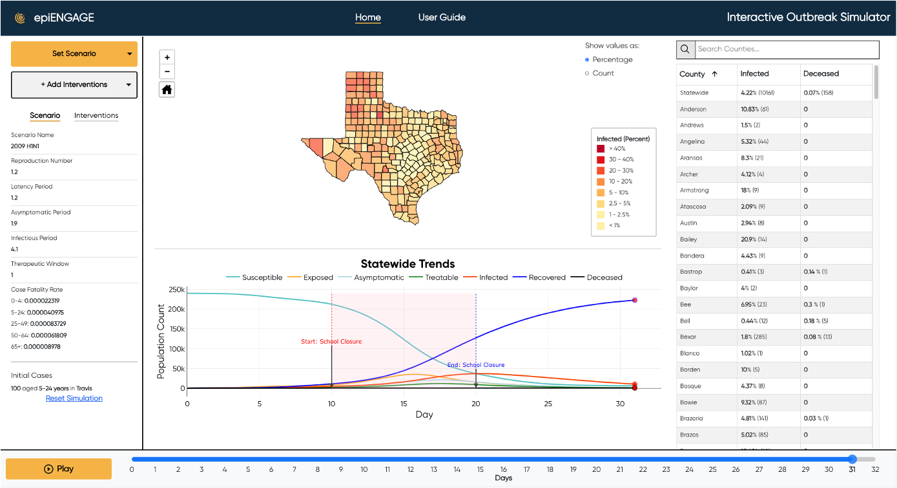

## PandemicExerciseTool

This repo contains the assets for the front-end GUI of the Interactive Outbreak
Simulator tool, as well as assets for the Django REST framework, task management,
and container orchestration. This project can be launched following the instructions
below. It will pull in the stand-alone 
[Python implementation](https://github.com/TACC/PandemicExerciseSimulator) 
of an outbreak simulator to serve as the backend engine.

### Requirements

Clone this repository using Git, launch the services using Docker, then interact
with the tool from a web browser.

* [Git](https://git-scm.com/book/en/v2/Getting-Started-Installing-Git)
* [Docker](https://www.docker.com/products/docker-desktop/)


### Quick Start

#### Clone the repository

```bash
git clone https://github.com/TACC/PandemicExerciseTool
```

#### Start the production environment

```bash
make start
```

Open [http://localhost:3000](http://localhost:3000) to view it in your browser.


#### Stop the production environment

```bash
make stop
```

#### Using the Tool



1. Under 'Set Scenario', assign custom disease parameters or select parameters
   from the drop down list
2. Under 'Set Scenario', add initial infected cases to at least one county
3. (Optional) Under 'Add Interventions', add new non-pharmaceutical intervention
   strategies
4. Click 'Play' to begin evolving the simulation
5. Explore the interactive map, plot, and table
6. Click 'Pause' and 'Reset Simulation' to start over
