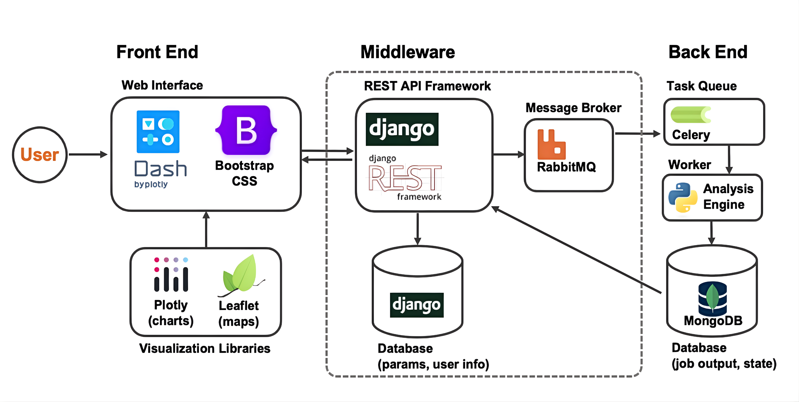

# Interactive Outbreak Simulator
A Python Dash-based pandemic and epidemic simulation application that integrates with the 
[Pandemic Exercise Simulator](https://github.com/TACC/PandemicExerciseSimulator/) backend engine 
to model epidemics within all 50 US states + DC.

## Features
- **Multiple Models**: Deterministic and Stochastic compartmental/mechanistic models
- **Interactive Controls**: Configure disease parameters and initial cases
- **Interventions**: Model non-pharmaceutical interventions and vaccination across age groups
- **US Counties**: Interactive maps with county-level visualizations
- **Realistic population subgroups**: Population data from 2023 census stratified by age and high & low risk of severe outcome
- **Real-time Simulation**: Live epidemic progression visualized on map and in time series
- **Docker Ready**: Complete containerized deployment

## Quick Start
### Prerequisites
- Docker and Docker Compose
- 8GB+ RAM recommended
- Ports 8000, 8050, 6379, 27017 available

### One-Command Startup
Ensure the Docker application is running in the background.
```bash
git clone https://github.com/saroshaprasla/PandemicExerciseTool-Dash.git
cd /your/path/to/PandemicExerciseTool-Dash
docker-compose -f docker-compose-dash.yml up --build -d
```
or using the Makefile
```bash
make start
```

### Access the Application
- **Main Application**: http://localhost:8050
- **Backend API**: http://localhost:8000
  - click `api/pet` to see parameters sent to backend engine each run

To check logs of containers find the container name or id, then print logs to your terminal window. 
The `-f` flag will allow you to watch a log live. `Ctrl+C` will exit the log.
```bash
docker ps
docker logs <container_name_or_id>
docker logs -f <container_name_or_id>
```

### End Application
```bash
make stop
```
which is equivalent to running
```bash
docker compose -f docker-compose.yml down
```

## Architecture



### Services
- **dash-frontend** (Port 8050): Python Dash web application
- **django-backend** (Port 8000): REST API and data management
- **celery-worker**: Background simulation processing with backend engine
- **mongo-db** (Port 27017): Simulation data storage
- **redis** (Port 6379): Celery message broker and caching
